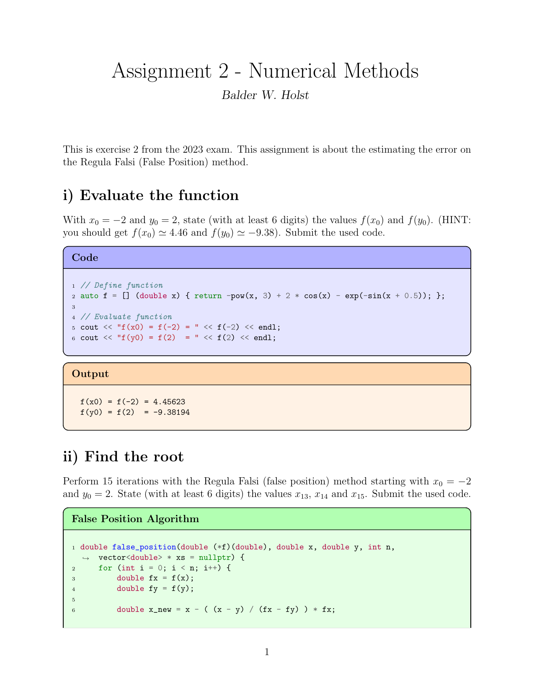

# Reportify your C!
This repo contains a script with compiles your C or C++ code into a nice report.

## Example
Using `reportify` you can write code like this:

```c++
int main() {

    TITLE("Assignment 2 - Numerical Methods"); // Define the title of the document
    AUTHOR("Balder W. Holst");                 // Define the author of the document

    //! This is exercise 2 from the 2023 exam. This assignment is about the estimating the error on the Regula Falsi (False Position) method.
/*  ^^^-- "Magic" comment. Comments like this will be pasted into the document. */

    SECTION("i) Evaluate the function"); // Create a section in the document

    //! With $x_0 = -2$ and $y_0 = 2$, state (with at least $6$ digits) the values $f(x_0)$ and $f(y_0)$. (HINT: you should get $f(x_0) \simeq 4.46$ and $f(y_0) \simeq -9.38$). Submit the used code.

    SHOW; // Show the following code in the report

    // Define function
    auto f = [] (double x) { return -pow(x, 3) + 2 * cos(x) - exp(-sin(x + 0.5)); };

    // Evaluate function
    cout << "f(x0) = f(-2) = " << f(-2) << endl;
    cout << "f(y0) = f(2)  = " << f(2) << endl;

    OUTPUT; // End the code block and display the standard output of the code block above

    SECTION("ii) Find the root");
    //! Perform $15$ iterations with the Regula Falsi (false position) method starting with $x_0 = -2$ and $y_0 = 2$. State (with at least 6 digits) the values $x_{13}$, $x_{14}$ and $x_{15}$. Submit the used code.

    SPAN("False Position Algorithm", __FILE__, 16, 35); // Show a code block with code given the file path and start and end line numbers

    ...
}
```

This results in a report like this:

